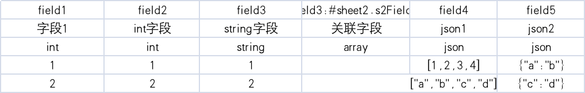

# xlsxToConfig
将xlsx生成为对应配置

命令： `go run main.go -i 输入的目录 -o 输出的目录  -f 文件名1,文件名2，文件名3`

# 命令行参数:
- -i：输入的目录
- -o：输出的目录
- -f：需要转换的xlsx文件，允许多个英文逗号隔开，不携带该参数则转换所有的xlsx

# 标识符:

- id：特殊类型,设置索引key，若是整型字符串会转换成int，否则类型为string
- string：字符串
- int：整型
- float：浮点数
- array：关联,在第一列需要设置字段名:#子表名.关联的字表字段名
- json：支持`[]`和`{}`结构


# 示范
sheet1



sheet2


将生成
```
{
    "1": {
        "field1": 1,
        "field2": 1,
        "field3": {
            "1": {
                "s2Field1": 1,
                "s2Field2": 1,
                "s2Field3": "表1的field1关联的数据1"
            },
            "2": {
                "s2Field1": 1,
                "s2Field2": 2,
                "s2Field3": "表1的field1关联的数据2"
            }
        },
        "field4": [
            1,
            2,
            3,
            4
        ],
        "field5": {
            "a": "b"
        }
    },
    "2": {
        "field1": 2,
        "field2": 2,
        "field3": {
            "1": {
                "s2Field1": 2,
                "s2Field2": 1,
                "s2Field3": "表1的field1关联的数据3"
            },
            "2": {
                "s2Field1": 2,
                "s2Field2": 2,
                "s2Field3": "表1的field1关联的数据4"
            }
        },
        "field4": [
            "a",
            "b",
            "c",
            "d"
        ],
        "field5": {
            "c": "d"
        }
    }
}
```


# 开发计划:
- 支持生成json
- 支持生成php(格式化问题正在想办法)
- 支持命令行指定io目录
